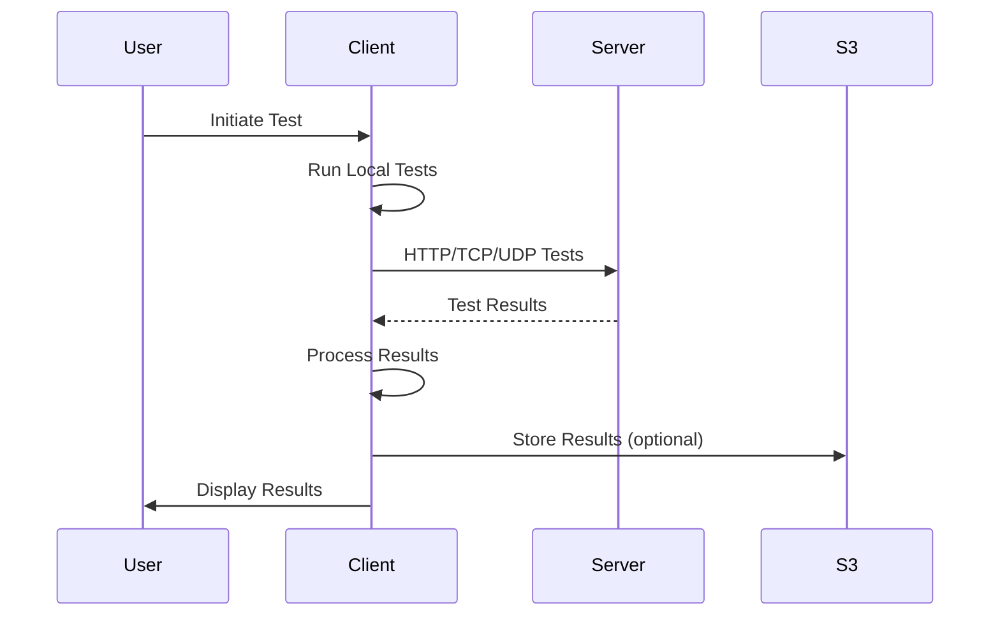

# WaddlePerf Architecture

## System Overview

WaddlePerf is a distributed network performance testing platform consisting of client and server components that work together to provide comprehensive network diagnostics and monitoring.

```
┌─────────────────────────────────────────────────────────────┐
│                        WaddlePerf System                      │
├───────────────────┬───────────────────┬────────────────────┤
│   Client Component │   Server Component │    Go Desktop Client│
├───────────────────┼───────────────────┼────────────────────┤
│   Python/py4web   │   Python/Flask     │    Go/System Tray  │
│   Ansible         │   nginx/iperf3     │    Native Tests    │
│   Test Tools      │   GeoIP/Speed Test │    Log Files       │
└───────────────────┴───────────────────┴────────────────────┘
```

## Component Architecture

### Client Component

#### Technology Stack
- **Runtime**: Python 3.9+ with py4web framework
- **Automation**: Ansible for configuration management
- **Testing Tools**: Collection of network diagnostic utilities
- **Deployment**: Docker container or standalone installation

#### Key Modules

##### Web Interface (py4web)
```
client/web/apps/_default/
├── controllers.py    # HTTP endpoints and API routes
├── models.py         # Data models and database schema
├── templates/        # HTML templates
│   ├── index.html
│   ├── system.html
│   └── auth.html
└── static/          # CSS, JS, and static assets
```

##### Testing Binaries
```
client/bins/
├── getSysInfo.py     # System information collector
├── httptrace.py      # HTTP traceroute implementation
├── mtuFinder.py      # MTU discovery tool
├── perfDB.py         # Performance database manager
├── ppingParser.py    # PPING output parser
├── resolverTime.py   # DNS resolution timing
├── sshping.py        # SSH connectivity tester
├── udpping.py        # UDP ping implementation
└── waddledb.py       # Main database interface
```

##### Ansible Automation
```
client/jobs/
├── build/           # Build-time tasks
├── integrate/       # Integration tests
├── run/            # Runtime execution
│   ├── autoperf.yml
│   ├── client.yml
│   ├── cron.yml
│   └── mtr.yml
└── tests/          # Test suites
```

### Server Component

#### Technology Stack
- **Web Server**: nginx as reverse proxy
- **Application**: Flask for REST API
- **Testing Server**: iperf3 for bandwidth testing
- **Database**: SQLite for local storage
- **GeoIP**: MaxMind GeoLite2 for location services

#### Architecture Layers

##### Web Layer (nginx)
```nginx
server {
    listen 80;
    listen 443 ssl;
    
    location / {
        proxy_pass http://flask-app:5000;
    }
    
    location /speedtest {
        alias /app/libs/speedtest;
    }
}
```

##### Application Layer (Flask)
```python
# server/web/userstats.py
@app.route('/api/stats', methods=['POST'])
def user_stats():
    # Process user statistics
    # Store in database
    # Return JSON response
```

##### Service Layer
- **iperf3**: TCP/UDP bandwidth testing on port 5201
- **UDP Server**: Custom UDP ping server on port 2000
- **GeoIP Service**: IP geolocation lookup

### Go Desktop Client

#### Architecture
```
go-client/
├── cmd/waddleperf/     # Main application entry
│   └── main.go
├── internal/
│   ├── network/        # Network testing logic
│   │   └── client.go
│   ├── system/         # System information
│   │   └── info.go
│   └── ui/            # System tray interface
│       └── tray.go
```

#### Key Features
- **System Tray Integration**: Native OS integration
- **Continuous Monitoring**: Hourly automated tests
- **Manual Testing**: On-demand test execution
- **Local Logging**: Results stored in log files

## Data Flow

### Test Execution Flow



### AutoPerf Tier System

```
Tier 1 (Frequent - Every X minutes)
├── Basic connectivity check
├── Simple ping test
└── HTTP availability

    ↓ Threshold Exceeded

Tier 2 (Intermediate Diagnostics)
├── Detailed network trace
├── Bandwidth testing
├── DNS resolution analysis
└── Port connectivity scan

    ↓ Threshold Exceeded

Tier 3 (Comprehensive Analysis)
├── Full MTR trace
├── Extended iperf3 tests
├── SSL/TLS analysis
├── Complete system diagnostics
└── Packet capture (optional)
```

## Network Architecture

### Port Requirements

| Component | Port | Protocol | Purpose |
|-----------|------|----------|---------|
| Web UI | 8080 | TCP | Client web interface |
| HTTP | 80 | TCP | Server web interface |
| HTTPS | 443 | TCP | Secure web interface |
| iperf3 | 5201 | TCP | Bandwidth testing |
| UDP Ping | 2000 | UDP | UDP connectivity |
| SSH | 22 | TCP | SSH ping testing |

### Communication Protocols

#### REST API
```
POST /api/test/start
Content-Type: application/json
{
    "test_type": "comprehensive",
    "target": "server.example.com",
    "options": {
        "timeout": 30,
        "retries": 3
    }
}
```

#### WebSocket (Future)
```javascript
const ws = new WebSocket('wss://server:443/realtime');
ws.on('message', (data) => {
    // Real-time test updates
});
```

## Deployment Architecture

### Docker Deployment
```yaml
services:
  client:
    image: waddleperf-client
    networks:
      - waddleperf-net
    volumes:
      - results:/app/results
      
  server:
    image: waddleperf-server
    networks:
      - waddleperf-net
    ports:
      - "80:80"
      - "443:443"
      - "5201:5201"
```

### Kubernetes Deployment
```yaml
apiVersion: apps/v1
kind: Deployment
metadata:
  name: waddleperf
spec:
  replicas: 3
  selector:
    matchLabels:
      app: waddleperf
  template:
    spec:
      containers:
      - name: client
        image: waddleperf-client
      - name: server
        image: waddleperf-server
```

### High Availability Setup
```
        Load Balancer
             │
    ┌────────┼────────┐
    │        │        │
Server-1  Server-2  Server-3
    │        │        │
    └────────┼────────┘
          Database
         (Replicated)
```

## Security Architecture

### Authentication & Authorization
- **Client**: py4web built-in authentication
- **Server**: API key validation
- **Transport**: TLS/SSL encryption

### Data Protection
- **In Transit**: HTTPS/TLS 1.3
- **At Rest**: Encrypted S3 storage
- **Logs**: Sanitized output, no credentials

### Network Isolation
```
DMZ Zone
├── WaddlePerf Server (public facing)
└── nginx reverse proxy

Internal Zone
├── WaddlePerf Clients
├── Database servers
└── S3 storage endpoint
```

## Scalability Considerations

### Horizontal Scaling
- Stateless server components
- Load balanced endpoints
- Distributed test execution

### Vertical Scaling
- Resource allocation per component
- Database optimization
- Caching layer (Redis/Memcached)

### Performance Optimization
- Connection pooling
- Async task execution
- Result aggregation pipeline

## Monitoring & Observability

### Metrics Collection
- Prometheus exporters
- Custom metrics endpoint
- Performance counters

### Logging Strategy
- Centralized logging (ELK stack)
- Structured logging format
- Log rotation policies

### Alerting
- Threshold-based alerts
- Anomaly detection
- Integration with PagerDuty/OpsGenie